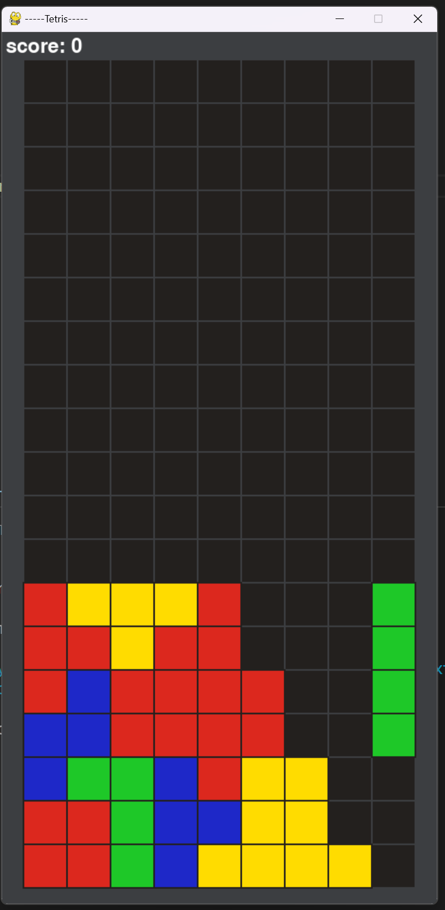
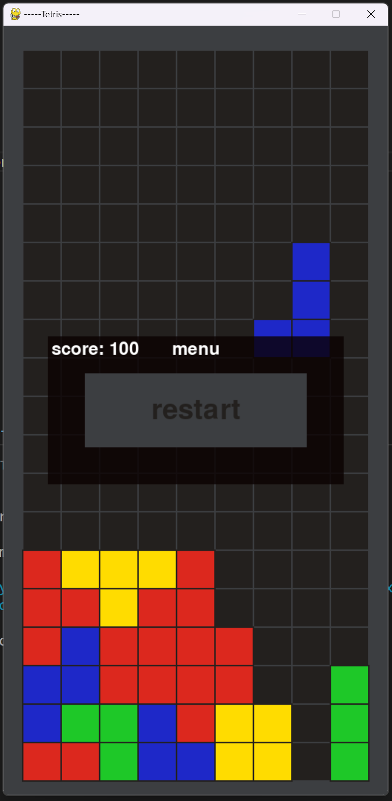

tetris game created with pygame
    - basic functionality:
        - shape rotation
        - shape colision
            - pushing to better spot if possible
        - score
        - menu
            - restart button

